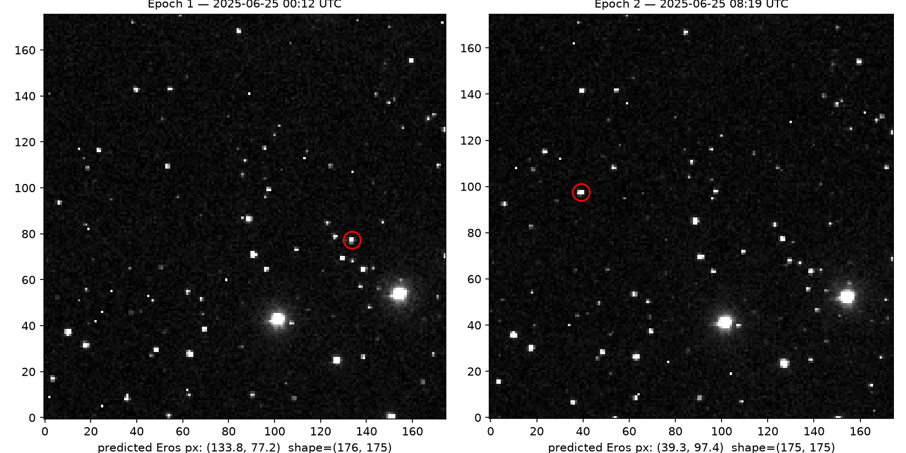
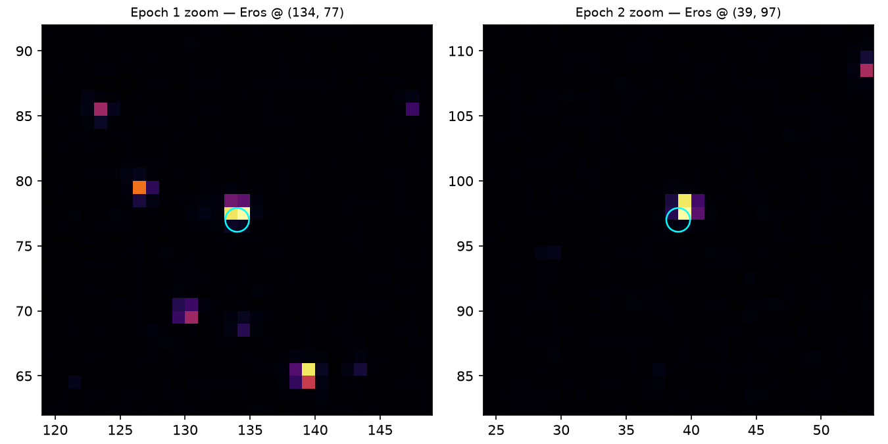

# Candidate Targets

Real, verified candidates for the blink-comparator gallery, found via IRSA's MOST tool (Moving Object Search Tool — see `IRSA_DATA_GUIDE.md`). Every entry here has been checked against actual SPHEREx archive matches, not just assumed.

## How these were found

MOST computes an object's ephemeris from its known orbit, then checks which SPHEREx exposures actually cover its predicted position at each epoch — no guessing required.

```
https://irsa.ipac.caltech.edu/cgi-bin/MOST/nph-most?catalog=spherex&input_type=name_input&obj_name={NAME_OR_NUMBER}&obs_begin={YYYY+MM+DD}&obs_end={YYYY+MM+DD}&output_mode=Brief
```
Returns an IPAC ASCII table: one row per matching exposure, with `ra`/`dec` of the object at that epoch, `start_date`/`end_date`, and `uri` (the archive file path — append `?center=...&size=...` per `IRSA_DATA_GUIDE.md` to pull a cutout instead of the full frame).

## Verified: 433 Eros

Queried 2026-10-02, window 2025-03-01 to 2026-10-01.

- **80 separate SPHEREx exposures** matched, spanning **2025-06-25 to 2025-07-07** (QR2, weeks 2025W26–2025W28).
- Near-Earth asteroid, well-catalogued (MPC designation A898 PA), so its ephemeris is reliable — low risk of a bad precovery match.

### Best same-day pair (story-mode hook candidate)

| | Epoch 1 | Epoch 2 |
|---|---|---|
| Date/time (UTC) | 2025-06-25 00:12:09 | 2025-06-25 08:19:18 |
| RA, Dec (deg) | 7.345405, 9.926905 | 7.482209, 10.027053 |
| Pointing | 2025W26_1A_0410_1 | 2025W26_1A_0465_1 |
| File | `ibe/data/spherex/qr2/level2/2025W26_1A/l2b-v20-2025-257/1/level2_2025W26_1A_0410_1D1_spx_l2b-v20-2025-257.fits` | `ibe/data/spherex/qr2/level2/2025W26_1A/l2b-v20-2025-257/1/level2_2025W26_1A_0465_1D1_spx_l2b-v20-2025-257.fits` |

**Computed separation:** ~604 arcsec (~10.1 arcmin) over ~8.12 hours — about **98 pixels** at SPHEREx's 6.15 arcsec/pixel scale. Comfortably visible in a single blink/swipe, and small enough (0.168°) to fit inside one cutout (max cutout size is 0.5°) centered between the two positions.

**Status: visually confirmed (2026-10-02).** Pulled both real cutouts (`?center=7.413807,9.976979&size=0.3`) and opened the `IMAGE` extension with astropy. Eros is a clean, obvious point source in both frames — not near a detector edge or gap, not confused with a background star:

| | Epoch 1 | Epoch 2 |
|---|---|---|
| Predicted pixel | (133.8, 77.2) | (39.3, 97.4) |
| Peak flux near predicted position | 10.39 | 10.02 |
| Local background | 0.38 | 0.37 |
| Local noise (std) | 0.42 | 0.35 |
| **Peak SNR** | **~23.7** | **~27.4** |

(SNR computed from a local 36×36px background box around the predicted position, not the whole-frame stddev — the frame contains two bright stars that would otherwise skew a naive noise estimate.) The detected peak sits 1–2 pixels from the MOST-predicted position in both frames, which is expected ephemeris/WCS rounding at this scale, not a misidentification — the same two background stars (including a bright close double, bottom-right of the full cutout) hold fixed pixel positions across both frames while the circled source clearly jumps, confirming it's the moving object and not noise.

Full-frame comparison and zoomed-in crops:




**This is a confirmed, demo-ready target.** It resolves the project's single biggest open risk (`PLAN.md`): a real asteroid, real SPHEREx data, real visible motion, real SNR — all grounded, nothing simulated.

## Still to check
- At least one more candidate with a *longer* baseline (days, not hours) to show slower, more "did-you-catch-it" motion as a second story beat — contrast with Eros's fast jump.
- A main-belt asteroid (slower mover, different story) as a variety target for the curated gallery, not just NEOs.
- Run the same MOST query for 2–3 other bright, well-known asteroids (e.g., 1 Ceres, 4 Vesta, 99942 Apophis) to build out the gallery beyond one object.
- Proper astrometric centroiding (fit the PSF, don't just trust the predicted pixel) once this moves into Phase 3 build work — the 1–2px offset is fine for a demo check, not for shipped precision.
